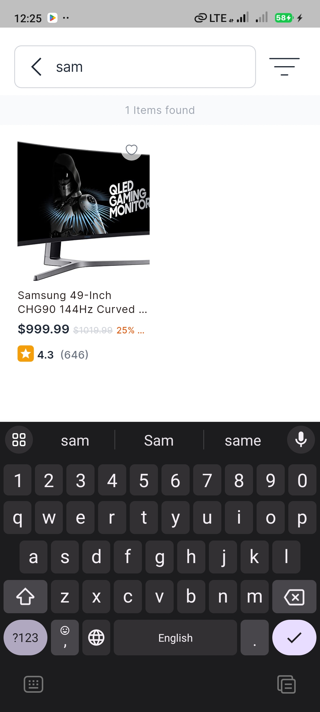
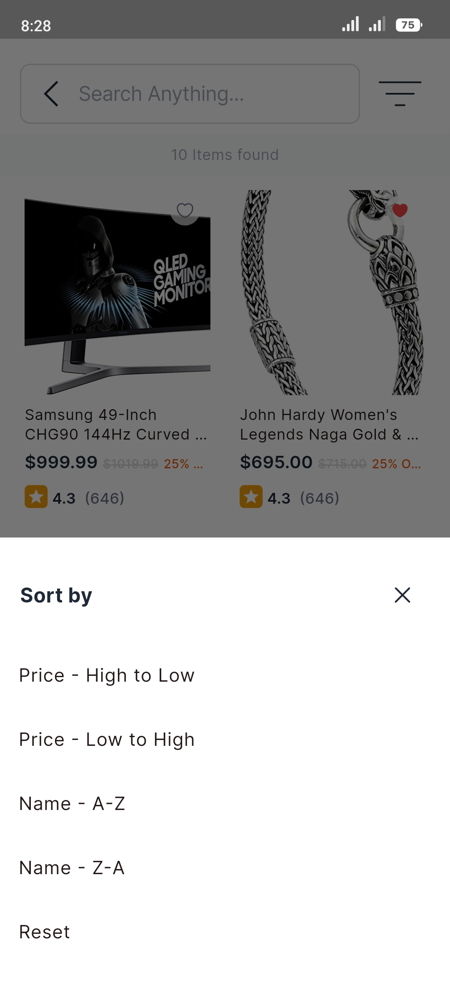
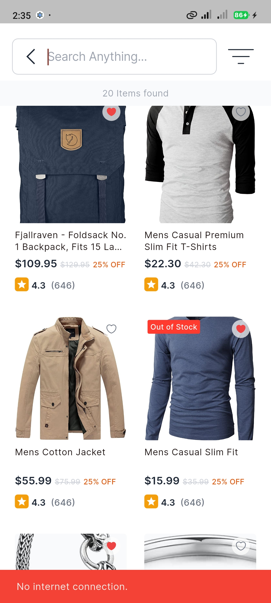

# Flutter Product List App

This is a professionally structured Flutter application developed as part of a performance optimization and architecture challenge. It demonstrates a complete e-commerce product listing interface with support for search, sorting, pagination, offline caching, and clean architecture using **Riverpod 2.0**.

---

## 🔧 Core Features

### ✅ 1. Product List
- Fetches products from the **FakeStoreAPI**
- Supports **pagination** by loading more products on scroll

### ✅ 2. Search & Filters
- **Search products** by name in real-time
- **Sort by**:
  - Price (Low to High)
  - Price (High to Low)
  - Name (A-Z / Z-A)
  - Reset to default

### ✅ 3. State Management & Performance
- Built using **Riverpod 2.0**
- Optimized widget tree to **minimize rebuilds**
- Professional UI code with **widget reuse** and **responsive layout**

### ✅ 4. Offline Support (Optional)
- API responses are **cached using Hive**
- When offline:
  - Displays **cached data**
  - Shows **snackbar notification**

### ✅ 5. Bonus: Clean Architecture
- Follows a **clean architecture structure** with:
  - `domain`, `data`, and `presentation` layers
  - Separated logic and presentation for better maintainability

---

## 🧪 Screenshots

| Product Listing | Search | Sort Options | Offline Snackbar |
|-----------------|--------|--------------|------------------|
|  |  |  |  |


---

## 🏗️ Tech Stack

- **Flutter** (Latest stable)
- **Riverpod 2.0**
- **Hive** for local storage
- **Dio** for networking
- **flutter_svg** for optimized assets
- **Responsive UI** using `flutter_screenutil`

---

## 📦 Project Structure (Clean Architecture)

```
lib/
├── core/
├── data/
│   ├── datasources/
│   ├── models/
│   └── repositories/
├── domain/
│   ├── entities/
│   ├── repository/
│   └── usecases/
├── presentation/
│   ├── pages/
│   ├── providers/
│   └── widgets/
└── main.dart
```


## 📢 Download Link

> 🔗 [Download App](https://github.com/arrahmanbd/qtec_flutter_task/releases/download/release/app-release.apk)

## 📃 License

This project is developed for educational and professional demonstration purposes. 

## 🚀  Follow
[](https://arrahmanbd.github.io/)
[](https://www.linkedin.com/in/arrahmanbd)
[](https://www.github.com/arrahmanbd)


